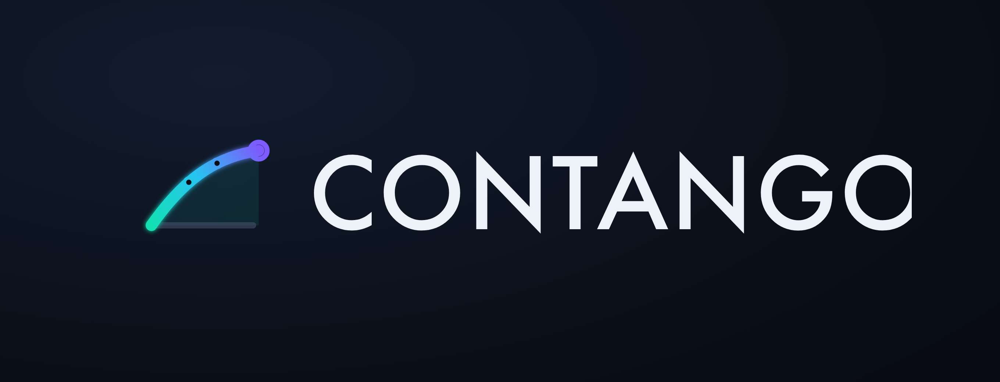

<p align="center">
  
</p>

<h1 align="center">Contango</h1>

<p align="center"><b>24/7 on-chain FX forwards for stablecoins — margin-and-code replace ISDA-and-credit-lines.</b></p>

<p align="center">
  Lock a future EURUSD rate with <b>$50 instead of $1M</b>, at 3am on a Saturday, with no bank and no ISDA —<br/>
  and a delta-neutral vault earns the carry.
</p>

<p align="center">
  
  
  
  
</p>

---

## The gap

Circle built **spot** FX on Arc — App Kit Swap today, StableFX for institutions. Nobody built the instrument every real FX use case actually needs: the **forward**.

An importer paying a EUR invoice in 60 days, a SaaS company with EURC revenue and USD payroll, an agent running a multi-currency treasury — none of them need spot. They need to **lock a rate for a future date**.

FX forwards are a **~$110T/yr** market. In TradFi they are *credit* instruments: ISDA paperwork, bank credit lines, T+2 settlement, closed on weekends, ~$1M minimum tickets. So SMEs get refused outright, or quoted 50–200bps. **That is the wedge.**

## The instrument

Contango is a **margined, cash-settled USDC/EURC forward book** with a **delta-neutral ERC-4626 carry vault** as its balance sheet.

**1. Pricing — Covered Interest Parity.** A forward is not an opinion about the future; it's spot plus the cost of carrying two currencies to the value date. No-arbitrage pins it:

```
F = S · (1 + r_USD·τ) / (1 + r_EUR·τ)
```

with `S` the USDC/EURC mid, `r_USD` = SOFR, `r_EUR` = €STR (live published fixings posted on-chain by a rates keeper), and `τ` the ACT/360 year fraction. When `r_USD > r_EUR` the curve slopes up — *contango* — and `F − S` is the forward points the desk earns.

**2. Market-making — inventory-skewed quoting (Avellaneda–Stoikov-lite).** The protocol desk is the counterparty to every ticket. It quotes around a skewed mid:

```
mid = F · (1 + skew),   skew = −k · (deskInventory / maxInventory)
```

so the desk's own axe moves the price: a one-sided book makes the next ticket on that side pay up, and pays the other side to flatten it. The off-chain quant engine adds a **bounded** alpha overlay on top — it can never escape the on-chain rails.

**3. Carry Vault — FX swap-desk economics on-chain (ERC-4626).** Every forward written is immediately **delta-hedged in spot through App Kit Swap**, so vault P&L is **spread + carry + margin fees, never directional FX**:

- **Spread** — bid/ask captured around CIP fair value, booked on day one.
- **Carry** — as `τ → 0`, forward points roll down to zero. Marking the desk's book to the CIP curve makes this fall out of the accounting for free: it *is* the carry.
- **Margin fees** on open positions.

Depositors get *"USD yield from FX flow"* — not emissions, not lending risk.

## Why this is only possible on Arc

> A forward is a promise that has to survive until expiry — which is exactly why TradFi wraps it in credit. On Arc, three properties replace the credit line:
>
> 1. **Deterministic sub-second finality** → real-time variation margin and instant, non-reorgable liquidation. You can run a clearing house's risk engine every block.
> 2. **USDC-native gas** → a margin top-up costs a known fraction of a cent, which collapses the minimum ticket from **$1,000,000 to $1**.
> 3. **Native USDC + EURC** → both legs settle atomically, 24/7, including Saturday, when every TradFi desk on earth is closed.

**The capital-markets flourish:** the forward curve *is* the market-implied USD–EUR rate differential. Contango bootstraps **Arc's first on-chain stablecoin FX yield curve** — a primitive other Arc protocols can consume. Capital markets are built on a forward curve. Arc doesn't have one. We built it.

## Architecture

| Component | Role | Circle / Arc primitive |
|---|---|---|
| [`ForwardEngine.sol`](contracts/src/ForwardEngine.sol) | Margined USDC/EURC forward book: open / margin / mark-to-market / liquidate / cash-settle, fixed weekly expiries | Arc EVM; USDC-native gas; sub-second finality makes the margin loop safe |
| [`CarryVault.sol`](contracts/src/CarryVault.sol) | ERC-4626 desk balance sheet; holds the EURC hedge inventory, accrues spread + carry | Arc; native USDC / EURC |
| [`RateOracle.sol`](contracts/src/RateOracle.sol) | Medianised dual-source spot + SOFR/€STR fixings, staleness guard, circuit breaker | App Kit Swap mid as one source, ECB reference as the other |
| [`CIP.sol`](contracts/src/libraries/CIP.sol) | The pricing kernel: covered interest parity, forward points, implied rate differential | — |
| [`ISpotVenue`](contracts/src/interfaces/ISpotVenue.sol) | Hedge execution surface — `AppKitSwapVenue` live, `StableFXVenue` snaps in behind the same interface | **App Kit Swap** executes every hedge; **StableFX** when Circle issues the key |
| Quant engine (Node/TS) | CIP fair value, inventory-skewed quoting, delta-hedger, oracle keeper, liquidation keeper | Circle Developer-Controlled Wallets |
| **Hedger Agent** | Autonomous agent with its own wallet: watches a merchant's EURC inflows, applies a hedge policy, buys firm quotes, opens/rolls/settles forwards unattended | Circle Wallets + **x402** nanofee per firm quote |
| Dashboard (Next.js) | Live forward curve, trade ticket, vault NAV/APY, margin health, liquidation console, agent feed | — |

### Risk machinery

- **Initial margin 8% / maintenance 4%**, sized off the 99th-percentile weekly EURUSD move (~1.5%) — because the desk cannot make a margin call by phone at 3am on a Sunday.
- **Medianised dual-source oracle** with a disagreement guard: if the feeds diverge beyond tolerance the engine stops opening *and* stops liquidating, rather than trusting either print.
- **Per-update circuit breaker**: a median that jumps more than 5% in one update is rejected and trips the breaker for guardian review. Real gaps get walked in; garbage prints don't.
- **Permissionless keeper liquidations**, final in one block.
- **Desk cover ratio** — the desk must hold capital against open interest before it can write more.
- **Bad debt is surfaced, never hidden** (`totalBadDebt`, `BadDebt` event).
- **Cash accounting identity**, asserted by the invariant suite: every USDC in the engine is either trader margin or desk cash.

## Repo layout

```
contango/
├── contracts/           Foundry — the protocol
│   └── src/
│       ├── ForwardEngine.sol      the forward book + margin engine
│       ├── CarryVault.sol         ERC-4626 desk balance sheet
│       ├── RateOracle.sol         medianised spot + SOFR/€STR fixings
│       ├── libraries/CIP.sol      covered interest parity
│       ├── libraries/Expiries.sol listed weekly value dates (Fri 16:00 UTC)
│       ├── interfaces/            IRateOracle, ISpotVenue
│       └── venues/                spot execution adapters
├── engine/              Node/TS quant engine (pricing, quoting, hedging, keepers)
├── web/                 Next.js risk dashboard
├── STRATEGY.md          full spec: quant strategy, architecture, demo script, build plan
├── docs/                idea evaluation + naming rationale
└── brand/               logo + palette
```

## Build

```bash
cd contracts
forge build
forge test
```

Arc testnet: RPC `https://rpc.testnet.arc.network`, explorer `testnet.arcscan.app`, assets USDC / EURC via the Circle faucet.

## Status

- ✅ Deep research — 18 past-winner repos analysed; **zero** used App Kit Swap / CCTP / Gateway / StableFX, and none built a quant DeFi product. The lane is open and it is Circle's stated priority.
- ✅ Protocol core in Solidity: `ForwardEngine`, `CarryVault`, `RateOracle`, CIP + expiry libraries, spot-venue adapters.
- ▶️ Quant engine, dashboard, Hedger Agent, Arc testnet deployment.
- 📅 Final MVP + 3-min video + deck — 9 Aug · Demo Day — 20 Aug.

**Tracks:** DeFi (primary) + Agentic Economy — one project, both tracks. The Hedger Agent is a real autonomous customer with its own wallet; the protocol stands alone without it.

---

<p align="center"><i>"Capital markets are built on a forward curve. Arc doesn't have one. We built it."</i></p>
